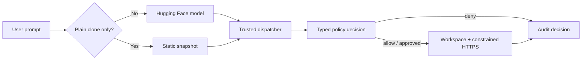

# WebClonerAI CLI

WebClonerAI CLI is a security-focused website snapshot and editing agent. It makes
website cloning reproducible while placing every model-requested operation behind a
deterministic policy boundary.

For a plain clone, it downloads the original server-rendered page, localizes its
CSS, fonts, and media, and writes a static preview without calling an LLM. For a
clone-plus-change request, a Hugging Face-hosted model can make narrowly governed
edits after the snapshot exists.

This is a portfolio MVP for controlled coding-agent execution. It is not a general
web archiver, a browser sandbox, or a complete enterprise security product.

## Highlights

- Deterministic static snapshots for exact `Clone https://…` requests—no API key,
  model latency, or token cost.
- React/Next.js streaming fallback support using server-delivered markup without
  executing the target site’s JavaScript.
- Exact-host HTTPS allowlists, public-IP validation, redirect revalidation, pinned
  numeric TLS connections, timeouts, and response-size limits.
- Descriptor-relative workspace operations that reject path escapes, symlinks, and
  hard links.
- Typed allow / deny / require-approval decisions with structured audit logs.
- Focused `replace_text` edits for small text or color changes.
- Read-only local audit dashboard and offline fixtures for repeatable verification.

## Quick start

Requirements: Linux, Python 3.11+, and `pip`.

```bash
git clone https://github.com/Pratham-Onkar-Singh/WebClonerAI-CLI
cd WebClonerAI-CLI

python3 -m venv .venv
. .venv/bin/activate
pip install -r requirements.txt

python3 -m unittest discover -v
python3 -m webcloner.demo
```

The demo uses recorded model responses and mocked network transport. It does not
make an API request or fetch a live website.

## Clone a website without an LLM

Create a policy for the target. `fetch_hosts` accepts exact lowercase hostnames
only—never `https://`, paths, or wildcards.

```bash
cp policies/default.json policies/my-site.json
```

Edit `policies/my-site.json` to permit the site and any required asset/CDN hosts:

```json
{
  "fetch_hosts": ["example.com", "www.example.com"]
}
```

Then run an exact clone command:

```bash
python3 agent.py \
  --workspace output/example \
  --policy policies/my-site.json \
  "Clone https://www.example.com/"
```

The snapshot is written to `output/example/`:

```text
output/example/
├── index.html
├── snapshot.json
└── assets/
    ├── media/
    └── styles/
```

Preview it locally:

```bash
python3 -m http.server 8000 --directory output/example
```

Open <http://127.0.0.1:8000>. `snapshot.json` records asset failures and whether a
React streaming boundary was unwrapped. Generated snapshots are ignored by Git.

## Make a focused change with a model

Any instruction beyond a plain clone uses the model-backed workflow. Set your
Hugging Face token through the shell, not a committed `.env` file:

```bash
export HUGGINGFACE_API_KEY="your_token"
export WEBCLONER_MODEL="Qwen/Qwen2.5-Coder-32B-Instruct"
export WEBCLONER_MAX_TOKENS=4096

python3 agent.py \
  --workspace output/site-with-change \
  --policy policies/my-site.json \
  --max-steps 12 \
  "Clone https://www.example.com/ and change the primary orange color to blue"
```

The expected model sequence is:

```text
clone_page → read_file once → replace_text → OUTPUT
```

`replace_text` is an exact, policy-governed in-place edit. It supports
`mode: "one"` for a unique match and `mode: "all"` for every matching occurrence.
The default model response budget is 8,000 tokens; `WEBCLONER_MAX_TOKENS` may be
set between 512 and 16,000 if your model/provider supports it.

## How it works



The dispatcher is the only supported route from model output to file, network, or
container operations. It validates the tool schema, evaluates policy, writes an
intent audit event, rechecks constraints immediately before execution, then records
the outcome.

## Tool policy

| Tool | Permission | Purpose |
| --- | --- | --- |
| `clone_page(url)` | fetch + write | Create a bounded static snapshot with localized CSS/media. |
| `fetch_url(url)` | fetch | Retrieve an approved HTTPS page as a bounded model summary. |
| `download_asset(url, filename)` | fetch + write | Download one approved asset into the workspace. |
| `read_file(filename)` | read | Read a regular workspace file; large files return a bounded preview. |
| `write_file(filename, content)` | write | Atomically replace a complete regular workspace file. |
| `replace_text(filename, old, new, mode)` | write | Make a focused exact replacement without returning page contents. |
| `list_files(directory)` | read | List a workspace directory without creating it. |
| `execute_command(job, filename)` | process | Run only the fixed `validate_html` job in a pinned container. |

Policies have only four permission categories—`read`, `write`, `fetch`, and
`process`—with `allow`, `deny`, or `require_approval` outcomes. Unknown tools,
arguments, paths, and policy fields fail closed.

See [architecture and policy details](docs/ARCHITECTURE.md) and the
[threat model](docs/THREAT_MODEL.md) for enforcement assumptions and limitations.

## Local audit dashboard

The dashboard is read-only and intended for a local single-user machine.

```bash
python3 -m webcloner.api --audit .webcloner/demo-events.jsonl
```

In another terminal:

```bash
cd dashboard
npm ci --ignore-scripts
npm run build
npm start
```

Open <http://127.0.0.1:3000>. It displays recent decisions, matching rules, policy
versions, approval lifecycle events, and execution outcomes. It has no endpoint for
running tools, changing policy, or approving actions.

## Project structure

```text
agent.py                 CLI routing and model loop
prompt_config.py         Model tool protocol and constraints
webcloner/               Dispatcher, policy, network, file, snapshot, and audit code
dashboard/               Local Next.js audit viewer
policies/                Operator-controlled policy examples
tests/                   Offline unit and integration tests
docs/                    Architecture and threat model
reports/                 Reproducible verification evidence
```

## Verification

```bash
python3 -m unittest discover -v
python3 -m webcloner.demo
python3 -m webcloner.evaluate --repetitions 100
```

The current evidence includes 52 offline tests and 2,800 policy-only fixture
decisions with zero expected-verdict mismatches. Policy timings, fixture hashes,
test environment, and scope are recorded in [reports/evaluation.json](reports/evaluation.json)
and [reports/VERIFICATION.md](reports/VERIFICATION.md).

Optional checks:

```bash
python3 -m webcloner.verify_runner --image YOUR_LOCAL_REPOSITORY@sha256:YOUR_DIGEST
cd dashboard && npm run typecheck
```

## Important limitations

- Static snapshots intentionally remove site JavaScript. Client-only content,
  authenticated flows, animations, menus, and other interactive behavior may not
  work.
- Only exact HTTPS hosts permitted by the operator policy can be fetched. Add CDN
  hosts explicitly when a site depends on them.
- Model-backed requests send the prompt and redacted tool observations to Hugging
  Face Router. Do not place credentials or signed URLs in those prompts.
- The policy boundary governs supported tool actions; it does not protect against a
  compromised Python interpreter, malicious same-user process, or unsafe browser
  use of generated output.
- Clone only websites and assets you are authorized to copy. Generated output is
  local, untrusted, and intentionally excluded from version control.

## Project summary

- Built a Python website cloning agent with deterministic policy enforcement,
  action-bound approvals, IP-pinned HTTPS fetching, and structured audit logs.
- Implemented constrained static website snapshots with asset localization and
  React/Next.js server-streaming fallback handling.
- Added a local read-only Next.js audit dashboard plus offline adversarial fixtures
  and reproducible policy evaluation.
