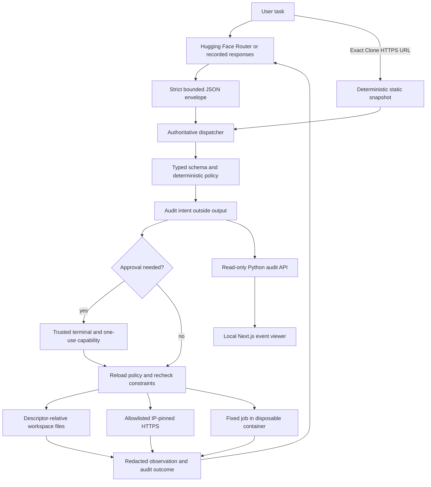

# Architecture and implementation record

## Execution path

Denied actions stop before execution. `tools.py` exports only `Dispatcher`; there
is no raw `TOOL_MAP` or independently exposed shell/file/download callable. Internal
Python classes remain callable by trusted application code and test harnesses, not
by model text. Policy does not protect against arbitrary code injected into the host
interpreter itself.

## Before and after

Baseline inspection confirmed `agent.py` dispatched parsed model arguments directly
through `TOOL_MAP`. `tools.py` fetched with automatic Requests redirects, used string
stripping for paths, and ran `subprocess.run(..., shell=True)` on the host. Asset
downloads used that same shell route. Listing created directories as a side effect.
The README described Groq/Llama while the code used Hugging Face Router/MiniMax.
Baseline `python3 -m unittest discover -v` found zero tests. No baseline live API calls
or adversarial host execution were performed. The new fixture reproduction is a
recorded-response run with a local transport, not evidence of live model quality.

Implementation phases:

1. Trace baseline and define the threat model; replace the tracked third-party
   website copy with a local recorded-fixture demo.
2. Add schemas, immutable policy snapshots, approvals, audit, and constrained tools.
3. Verify fixture clone, adversarial requests, mocked network behavior, and real
   container controls; export separate policy-only timing measurements.
4. Add a read-only API/dashboard and reproducible operator instructions.

## Policy format

JSON has exactly `version`, `permissions`, `fetch_hosts`, and `container_image`.
Permissions have exactly `read`, `write`, `fetch`, and `process`, each one of
`allow`, `deny`, or `require_approval`. No scripts, expressions, regex rules, or LLM
judges are accepted. Unknown fields/invalid policy abort startup. The effective
policy version includes SHA-256 of the complete policy file.

`download_asset` and `clone_page` require both fetch and write; deny wins, then
approval, then allow. `clone_page` fetches the original server-rendered HTML and
localizes linked CSS, CSS imports, fonts, images, `srcset`, posters, and inline CSS
resources. Downloads are bounded and use a small fixed worker pool. Active scripts,
event handlers, frames, embeds, and `javascript:` URLs are removed from the static
preview. For complete React/Next.js server-streamed boundaries, it moves the hidden
server-rendered content into place before removing the hydration script; it does not
run site JavaScript or invent data missing from the response. The deterministic
plain-clone shortcut ends after this call; model-backed clone-plus-change requests
instead receive its observation and may make the requested localized edit.
`replace_text` is a write-only focused edit: it requires a nonempty exact old value,
uses `mode=one` only for an unambiguous match or `mode=all` for every match, and
returns only the replacement count. It avoids placing an entire edited page in model
output or audit logs.
Every URL requires an exact host match (subdomains are not implicit). Network
permissions do not authorize process network access. A null image disables process
execution even if process permission allows it. An enabled image must be pinned by
digest; the one job accepts only `job=validate_html` and a relative `.html` filename.
`HTMLParser` is a basic parse smoke check, not a standards validator or visual test.

Schema, URL syntax/allowlist, and existing filesystem checks are included in policy
latency. DNS and connected-IP checks occur during execution. An `allow` policy
decision is permission to attempt an operation, not a guarantee of successful
execution: missing files, private DNS answers, unavailable Docker, or changed
constraints can still fail. The outcome event records these failures.

## Modules

- `agent.py`, `prompt_config.py`, `tools.py`: bounded model loop, tool protocol, facade.
- `webcloner/policy.py`, `dispatcher.py`, `approval.py`: validation and enforcement.
- `files.py`, `network.py`, `snapshot.py`, `runner.py`: constrained trusted execution backends.
- `audit.py`, `redaction.py`, `api.py`: observations, local audit, read-only API.
- `demo.py`, `evaluate.py`, `verify_runner.py`: explicitly labeled evidence runners.
- `tests/fixtures/v1/`: benign, malicious, approval, development and held-out fixtures.
- `dashboard/`: TypeScript/Next.js event browser; no approvals or mutation routes.

## Deferred extensions

An MCP adapter, provider comparisons, shadow-policy replay, authenticated remote
dashboard, dashboard approvals/CSRF protection, broader job types, cancellable DNS,
automated screenshot comparison, richer secret detection, and multi-user isolation are
optional future work. They are not part of the shipped MVP claims.
